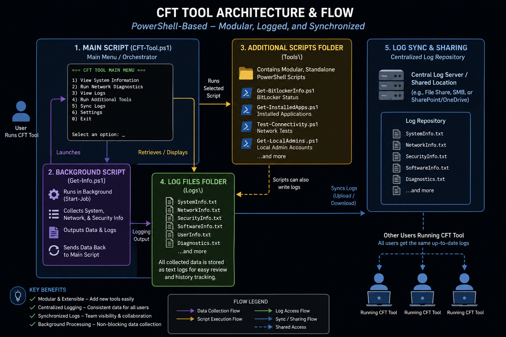
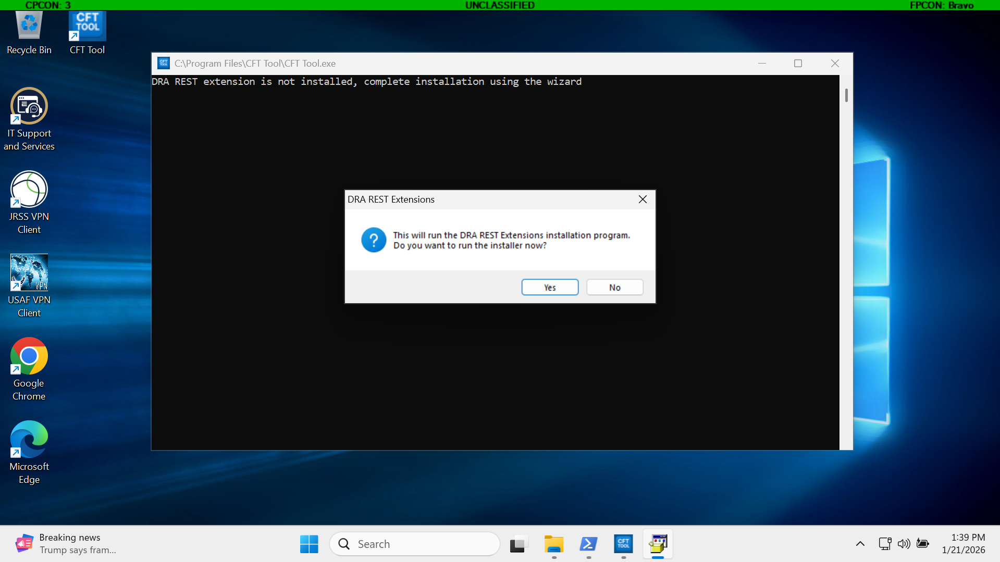
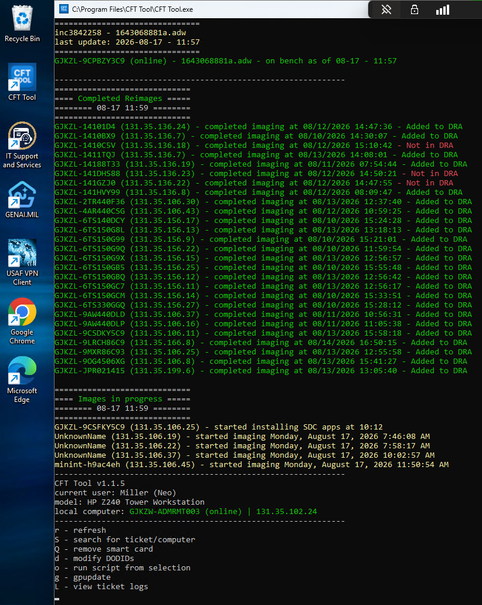
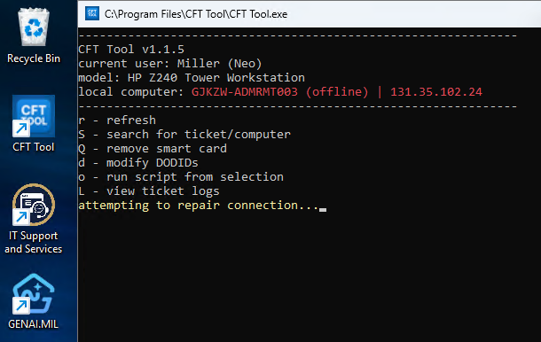
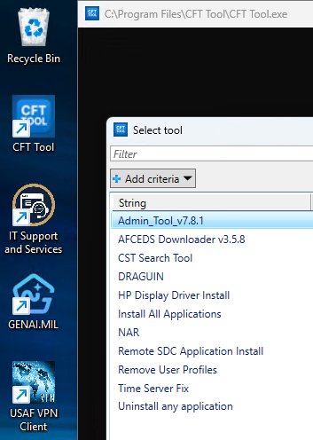

This is a showcase of my cybersecurity projects and code I've created.

# Projects

* * *
## Virtual SOC in Azure

### Honeypot Setup with Detection

*   Signed up for an Azure free trial with $200 in free credits.
*   Created a D2lds v6 (2 vcpus, 4 GiB memory) virtual machine running Windows 11 and port 3389 open.


*   Configured Microsoft Sentinel in a log analytics workspace with Windows Security Events via AMA as a Data Connector.
*   Created detection rules in Sentinel with KQL to detect event 4625 (Attempted RDP sign in) and event 4624 (Successful RDP sign in) to generate incidents in Sentinel


### Honeypot Results

*   Created a heatmap to track IPs and locations of attempted RDP connections using KQL to sort events

```Kusto
SecurityEvent
| where EventID == 4625
| where isnotempty(IpAddress) and IpAddress !in ("127.0.0.1", "::1", "-")
| summarize Count = count() by IpAddress
| extend GeoInfo = geo_info_from_ip_address(IpAddress)
| extend Latitude = toreal(GeoInfo.latitude)
| extend Longitude = toreal(GeoInfo.longitude)
| extend Country = tostring(GeoInfo.country)
| where isnotempty(Latitude) and isnotempty(Longitude) and isnotempty(Country)
| where Latitude between (-90.0 .. 90.0) and Longitude between (-180.0 .. 180.0)
| project Latitude, Longitude, Count, Country, IpAddress
| order by Count desc
```


### MISP Threat Intelligence Feed Integrated with Sentinel

*   Created a new Linux (Ubuntu 24.04) server and installed Docker


* Installed the MISP image on the Docker container and accessed the web GUI


*   Imported threat intelligence feeds into the MISP instance


*   Created an Azure function to send threat indicators to Sentinel every two hours via Python using the MISP API key and environment IDs from an Azure Key Vault while filtering out feeds with over 10,000 attributes to avoid exceeding rate limit.


*   After a while, Sentinel shows 282,328 Threat Intelligence Indicators, which can now be used with detection rules


# Code

* * *
## Powershell CFT (Cross Functional Team) Tool
### -_Developed for US Air Force_

*  Initial Diagram created when being pitched to supervisor



*  Initial Diagram created when being pitched to supervisor

### Initial Setup

*  Prompts for installation of the DRA REST Extensions and RSAT features to enable active directory features



### Main Menu

*  After initial setup, the main menu appears with information of the local computer, menu options, and status of imaging computers on the workbench



*  Log retrieval from WDS server and formatting for status of imaging computers

```PS
$Today = (Get-Date).Date
$LocalDate = Get-Date -Format yyyy:MM:dd
$LocalTime = Get-Date -Format HH:mm
$events = Get-WinEvent -LogName "Microsoft-Windows-Deployment-Services-Diagnostics/Operational" | Where-Object {$_.Id -in 4099 -and $_.TimeCreated -ge $today}
$IPAddresses = @()
$Times = @()
#gets IP Address and time started for each client in $events
$results = foreach ($event in $events){
    $message = $event.Message
    if ($message -like "*SDC 11.2409 WindowsPE.wim*"){
        $TimeStarted = $event.TimeCreated
        $parts = $message.Split(' ')
        $phrase = $parts[8]
        $IPAddress = $phrase.Replace("Filename:", "")
        $IPAddress = $IPAddress.Replace(" ", "")
        $IPAddress = $IPAddress.Replace("`r`n", "")
        if ($IPAddress -like "131.35*"){
            $IPAddresses += $IPAddress
            $Times += $TimeStarted
        }
    }
}
```

*  Verbose network insight: if the local computer or supporting servers goes offline, display status and attempt domain connection repair



```PS
$result = try{Test-ComputerSecureChannel -Server $domainname -Repair}catch{$false}
if ($result){
    $host.UI.RawUI.CursorPosition = $reconnectpos
    Write-Host "                                                      "
    Write-Host "Connection Restored           " -ForegroundColor Green
    Write-Host "Updating..." -ForegroundColor Yellow
}
if (!($result)){
    $simplerepairattempts ++
    if ($simplerepairattempts -ge 30){
        Remove-Item "HKLM\SOFTWARE\Microsoft\Windows NT\CurrentVersion\NetworkList\Profiles" -Force -EA SilentlyContinue
        $adapter = (Get-NetAdapter -Physical | Where-Object { $_.Status -eq "Up" }).Name
        if ($adapter){
            if (($adapter -notlike "*Wi-Fi*") -or ($adapter -notlike "*WiFi*")){
                Restart-NetAdapter $adapter
            }
        }
        $simplerepairattempts = 0
    }
} else {
    break
}
```

###  Script Selection

*  Upon pressing "O" a menu pops up allowing a number of additional scripts that can be run for silent and remote maintenance


